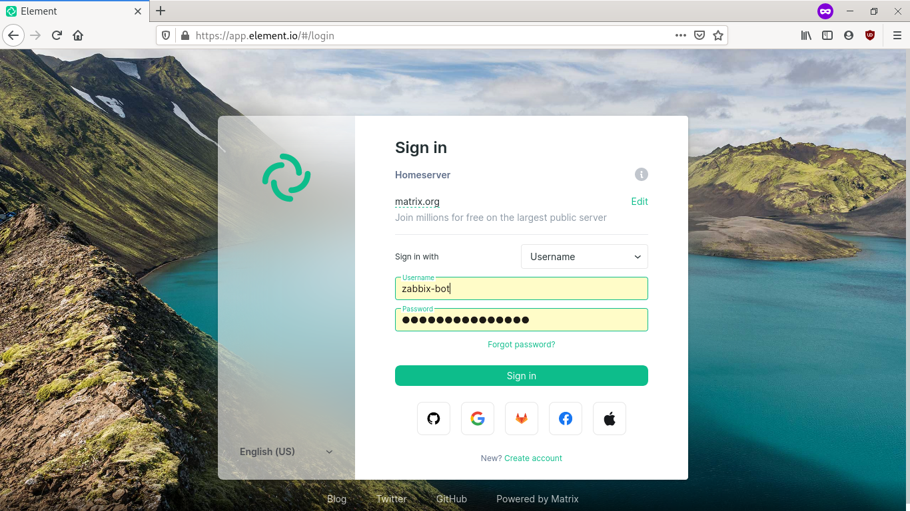
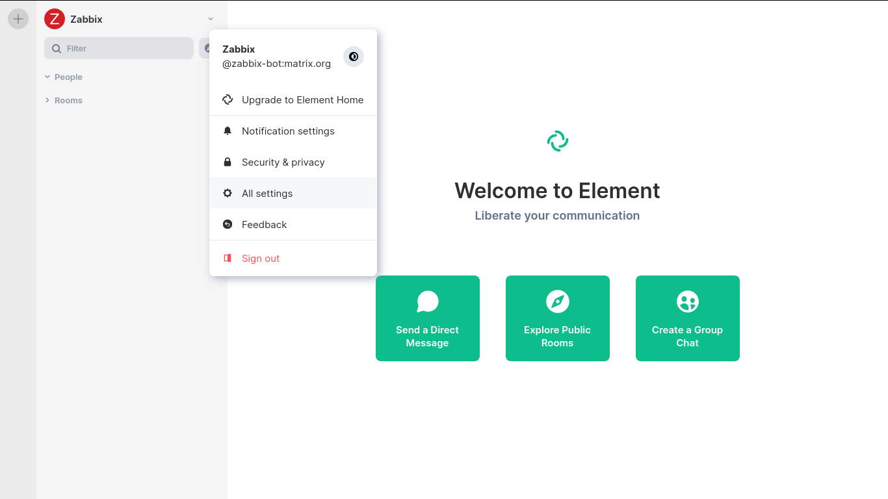
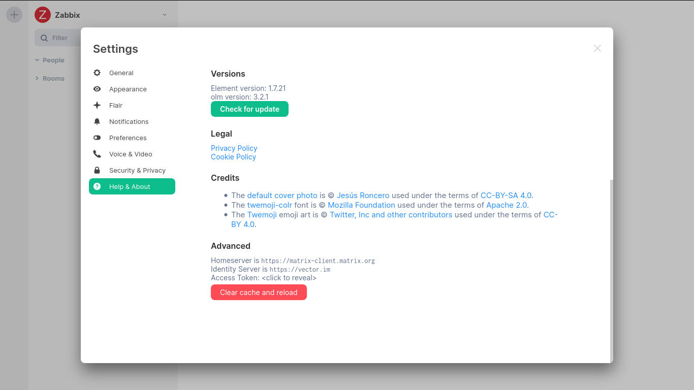
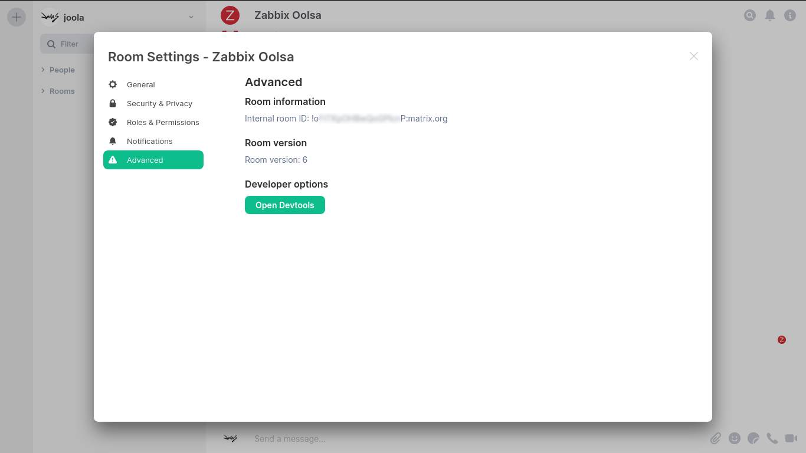

# Zabbix Matrix webhook

This guide describes how to integrate your Zabbix 4.4 installation with Matrix using the Zabbix webhook feature. This guide will provide instructions on setting up a media type.

## Matrix configuration

### Create a Matrix account

Visite [app.element.io](https://app.element.io/) and create a new account for your bot.

### Retreive the bot's access token

Open a **private/incognito** window in you browser, and sign in [app.element.io](https://app.element.io) with the bot account:

Open the bot account settings pages:

In the settings page, open the `Help & About` tab, scroll to the bottom `Advanced` section and click on `<click to reveal>` to retreive the access token:

Finally, **do not log out** (logging out invalidate the access token), instead, just close the **private/incognito** window.

### Setup a Matrix room

Invite the bot in the room you want the alerts to be send.

In the room settings page, open the `Advanced` tab and retreive the `Internal room ID`:

## Zabbix webhook configuration

Import the [`media_matrix.yml`](media_matrix.yml) file into your zabbix installation.

Configure the `<server_url>` and `<token>` missing values in the media type configuration.

Create or configure the `Matrix` media type for your user, and paste the `Internal room ID` in the `Send to` field.
