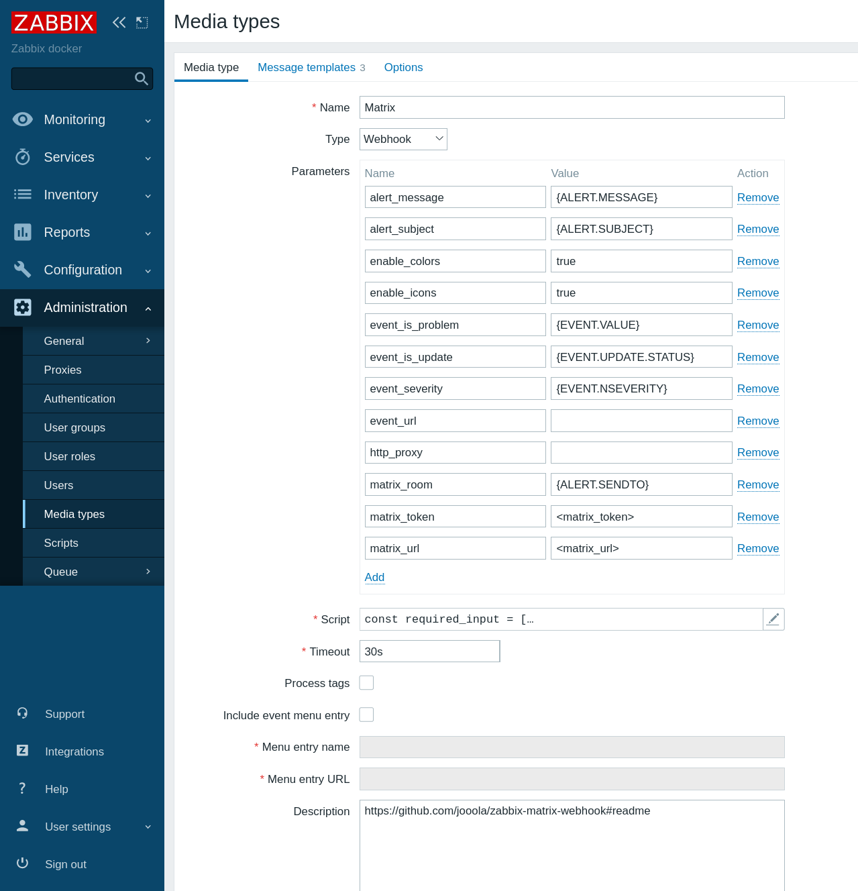
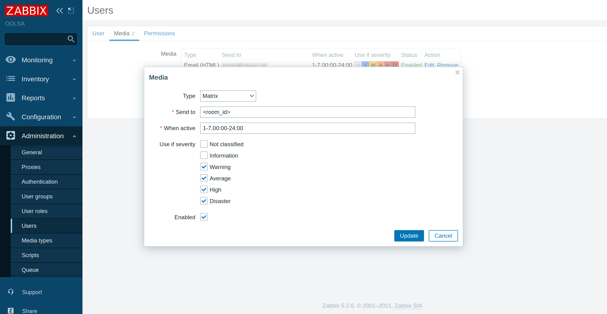

# Zabbix Matrix webhook

This guide describes how to integrate your Zabbix installation with Matrix using the Zabbix webhook feature. This guide will provide instructions on setting up a media type.

- Use the [main branch](https://github.com/jooola/zabbix-matrix-webhook/tree/main) for Zabbix 6.0 LTS and 6.2.
- USe the [5.0 branch](https://github.com/jooola/zabbix-matrix-webhook/tree/5.0) for Zabbix 5.0 LTS.

## Matrix configuration

The configuration of the webhook use [Element](https://element.io/) to interact with the Matrix server, but receiving notification from Zabbix work with any [Matrix client](https://matrix.org/clients/).

### Create a Matrix account

Visit [app.element.io](https://app.element.io/) and create a new account for your bot.

### Retrieve the bot's access token

Open a **private/incognito** window in you browser, and sign in [app.element.io](https://app.element.io) with the bot account:

Open the bot account settings pages:

In the settings page, open the `Help & About` tab, scroll to the bottom `Advanced` section and click on `<click to reveal>` to retrieve the access token:

Finally, **do not log out** (logging out invalidate the access token), instead, just close the **private/incognito** window.

### Set up a Matrix room

Invite the bot in the room you want the alerts to be sent.

In the room settings page, open the `Advanced` tab and retrieve the `Internal room ID`:

## Zabbix webhook configuration

In order to configure the webhook, you will have to know:

- [How to import media types](https://www.zabbix.com/documentation/current/manual/xml_export_import/media)
- [How to configure webhooks](https://www.zabbix.com/documentation/current/manual/config/notifications/media/webhook)

First, [import](https://www.zabbix.com/documentation/current/manual/xml_export_import/media#importing) the [`media_matrix.yml`](media_matrix.yml) file into your zabbix installation.

Then, in the media type configuration, fill the `<server>` value with the Matrix server [URL](https://en.wikipedia.org/wiki/URL) and `<token>` with the previously retrieved access token.

Finally, create or configure the `Matrix` media type for your user, and paste the `Internal room ID` in the `Send to` field:

